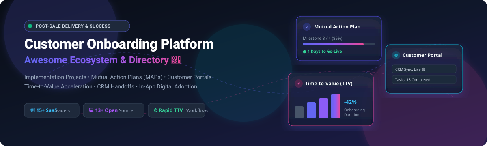

  

# Awesome Customer Onboarding Platform 🚀 🤝 📈

  <b>Curated Directory of SaaS Platforms &amp; Open-Source Projects for Customer Onboarding, Implementation Project Management, Mutual Action Plans (MAPs), Collaborative Customer Portals &amp; Post-Sale Delivery</b>

  
  
  
  
  
  

---

## 📌 Overview & Ecosystem

Welcome to **Awesome Customer Onboarding Platform** - an authoritative, SEO-indexed, and community-maintained guide to **Customer Onboarding Platforms**, **Implementation Project Management Systems**, **Mutual Action Plans (MAPs)**, **Digital Customer Portals**, and **Post-Sale Client Delivery Software**.

Effective customer onboarding bridges the critical gap between sales contract closure and initial product value realization. These curated platforms empower Customer Success (CSMs), Implementation Managers, Professional Services (PS), and Solutions Architects to:
- ⏱️ **Accelerate Time-to-Value (TTV)**: Standardize implementation playbooks, automate repeatable milestone handoffs, and eliminate deployment friction.
- 🤝 **Orchestrate Mutual Action Plans (MAPs)**: Keep clients and internal stakeholders aligned with shared milestone timelines, collaborative deliverables, and transparent accountability.
- 🌐 **Deploy Branded Customer Portals & Rooms**: Provide client-facing digital workspaces for document collection, embeddable tools, video walkthroughs, and live status reviews.
- 🔄 **Automate Sales-to-CS Handoffs**: Transfer account requirements, customized scope details, and contract terms directly from CRMs (HubSpot, Salesforce, etc.).
- 📊 **Track Onboarding Velocity & Health**: Measure early activation milestones, product adoption signals, and client sentiment to preempt churn before go-live.

---

## 📑 Table of Contents

- [🏢 SaaS & Hosted Platforms](#-saas--hosted-platforms)
- [💻 Open-Source GitHub Projects](#-open-source-github-projects)
- [🌟 Additional Open-Source Solutions & Architecture](#-additional-open-source-solutions--architecture)
- [🤝 How to Contribute](#-how-to-contribute)
- [⚠️ Disclaimer](#️-disclaimer)
- [⭐ Star History](#-star-history)

---

## 🏢 SaaS & Hosted Platforms

*Sorted by company size (valuation / estimated market standing) in descending order:*

| Platform | Description / Focus | Company Size (Valuation / Revenue) | Pricing (Starting Tier) | Free Tier / Free Trial Limits |
| :--- | :--- | :--- | :--- | :--- |
| **[Gainsight CS / Gainsight](https://www.gainsight.com/)** | Enterprise customer success and digital adoption platform with comprehensive onboarding journeys, health modeling, and 360-degree customer views. | ~$1.1B+ (Acquired by Vista Equity / $200M+ ARR) | Essentials tier starts at ~$150/user/month (billed annually; typically min. 5–10 seats = ~$9,000–$18,000/year) | 14-day free trial available for Gainsight PX (in-app product onboarding tours); 30-day proof-of-concept trial for Gainsight CS during enterprise scoping |
| **[Totango](https://www.totango.com/)** | Composable customer journey orchestration platform featuring modular SuccessBLOCs for structured customer onboarding, health tracking, and renewal management. | ~$250M+ (Merged with Catalyst / $146M+ Raised / $40M+ ARR) | Free Community Edition ($0/month) or $249/month (Starter tier; ~$2,988/year) | Free Forever Community Edition: includes up to 100 customer accounts, 3 users, and core onboarding SuccessBLOCs; 14-day free trial for Enterprise tiers |
| **[Planhat](https://www.planhat.com/)** | Customer platform providing onboarding workflows, customer-facing portals, playbook automation, health scores, and time-to-value metrics. | ~$200M+ (Est. Valuation / $50M Series A / $25M+ ARR) | Starts at ~$1,150/month (Startup tier, billed annually based on managed customer accounts with unlimited internal seats) | 14-day to 30-day customized POC sandbox environment with sample data following product demo (no permanent free plan) |
| **[Vitally](https://www.vitally.io/)** | Collaborative customer success platform combining real-time customer data sync, onboarding project tracking, and editable collaborative docs. | ~$180M+ (Est. Valuation / $39M Raised / Series B) | Starts at ~$1,500/month (~$18,000/year base tier based on customer account volume and CSM seats) | 14-day custom sandbox trial with customer data mapping upon sales demo (no permanent free plan) |
| **[ChurnZero](https://churnzero.com/)** | Real-time customer success platform with automated journey playbooks, in-app messaging, onboarding triggers, and milestone tracking. | ~$140M+ (Est. Valuation / $35M Raised / Series B / $25M+ ARR) | Starts at ~$10,700/year (~$892/month entry tier based on CSM seats and tracked customer account volume) | Free forever standalone Customer Success AI assistant tool; 14-day to 30-day guided POC sandbox for core platform |
| **[Rocketlane](https://www.rocketlane.com/)** | All-in-one professional services automation and customer onboarding platform combining project management, customer portals, time tracking, and resource planning. | ~$130M+ (Est. Valuation / $45M Raised / Series B) | Starts at $19/user/month (Essential plan, billed annually; 5-user minimum = $95/month) | 14-day free trial (full access to project templates, client portal, and up to 50 automation runs/user/month) |
| **[GuideCX](https://www.guidecx.com/)** | Customer onboarding & implementation platform with external client portals, automated milestone tracking, and onboarding health scoring. | ~$90M+ (Est. Valuation / $37M Raised / Series B) | Starts at ~$100/license/month (Starter tier, billed annually; 4-license minimum = ~$4,700/year) | 14-day free trial / interactive proof-of-concept sandbox upon request (no permanent free plan) |
| **[TaskRay](https://www.taskray.com/)** | Salesforce-native customer onboarding and post-sale project management tool offering Gantt charts, Kanban boards, and automated handoffs. | ~$80M+ (Acquired by Alpine Software Group / $15M+ ARR) | Starts at $25/user/month (Starter tier, billed annually; requires active Salesforce licenses; external client portal access is free) | 30-day free trial (full access to TaskRay project management within a dedicated Salesforce sandbox environment) |
| **[ClientSuccess](https://www.clientsuccess.com/)** | Customer success and onboarding lifecycle management platform providing customer journey maps, health scores, and collaborative success playbooks. | ~$50M+ (Est. Valuation / $10M+ Raised / Acquired Baton) | Starts at ~$15,000/year (~$1,250/month base tier for onboarding playbooks, CSM seats, and account management) | 14-day to 30-day guided proof-of-concept (POC) sandbox trial upon demo evaluation (no permanent free plan) |
| **[EverAfter](https://everafter.ai/)** | Digital customer hub and success room platform for sharing onboarding timelines, action plans, embedded tools, and deliverables. | ~$45M+ (Est. Valuation / $16M Raised / Series A) | Starts at ~$29,000/year (~$2,416/month base enterprise package with full CRM sync and unlimited customer portal viewers) | 14-day interactive sandbox / pilot trial environment upon sales consultation (no permanent free plan) |
| **[Dock](https://www.dock.us/)** | Collaborative client-facing portal and digital sales-to-onboarding workspace tool for sharing implementation plans, project checklists, and assets. | ~$30M+ (Est. Valuation / $6M Raised / Craft Ventures) | Free forever plan available ($0/month); Standard paid plan starts at $350/month (includes 5 internal users and unlimited workspaces) | Free forever plan: includes up to 50 active client workspaces, basic integrations (Slack, Loom, Typeform), and unlimited guest/client viewers |
| **[Arrows](https://arrows.to/)** | HubSpot & Salesforce-connected onboarding platform featuring collaborative mutual action plans, digital buyer/customer rooms, and live CRM sync. | ~$25M+ (Est. Valuation / $5M Raised / HubSpot Ventures) | Starts at $100/month (Sales Rooms) or $500/month (Growth Onboarding plan with CRM sync and unlimited viewer access) | 7-day free trial (no credit card required; full access to build action plan templates and test CRM sync) |
| **[OnRamp](https://www.onramp.io/)** | Customer onboarding platform purpose-built for B2B SaaS with dynamic customer-facing playbooks, collaborative tasks, and bi-directional CRM sync. | ~$20M+ (Est. Valuation / $3M Raised / Javelin Venture Partners) | Starts at ~$15,000/year (~$1,250/month base package including dynamic playbooks and unlimited external client participants) | 14-day interactive evaluation sandbox trial available following product consultation (no permanent free plan) |
| **[Baton](https://hellobaton.com/)** *(ClientSuccess)* | Collaborative customer onboarding and implementation software designed to streamline client handoffs, track milestone timelines, and standardize deployment. | ~$12M+ (Acquired by ClientSuccess / $3.3M Raised) | Starts at ~$6,000/year (~$500/month base implementation tier) | 14-day free trial (access to onboarding project templates, milestone tracking, and collaborative client workspaces) |
| **[SuiteWorks](https://www.suiteworks.com/)** | Implementation and post-sale delivery workflow platform natively built for NetSuite ecosystem projects and subscription operations. | ~$8M+ (Est. Valuation / NetSuite ISV Partner) | Base implementation packages start at ~$5,000/year (flat fee without per-user licensing penalties) | Guided interactive sandbox demo environment provided during implementation scoping (no permanent free plan) |

---

## 💻 Open-Source GitHub Projects

*Sorted by GitHub Star Count in descending order:*

- **[Driver.js](https://github.com/kamranahmedse/driver.js)**   
  ⚡ Lightweight, vanilla JavaScript engine to drive user focus across web applications for interactive step-by-step onboarding walkthroughs, feature highlights, and product tours with zero dependencies.

- **[Intro.js](https://github.com/usablica/intro.js)**   
  🌟 Battle-tested open-source library for creating guided user onboarding step-by-step tours, new feature introductions, floating contextual tooltips, and progress indicators.

- **[Shepherd](https://github.com/shipshapecode/shepherd)**   
  🐑 Modern, accessible JavaScript library for guiding users through web apps, with official framework wrappers for React, Vue, Angular, Ember, and Svelte.

- **[OpenProject](https://github.com/opf/openproject)**   
  📊 Leading open-source project and portfolio management platform. Excellent foundation for structured customer implementation projects, Gantt timelines, task tracking, and milestone collaboration.

- **[React Joyride](https://github.com/gilbarbara/react-joyride)**   
  🚀 Feature-rich React library for creating customized, animated product tours, onboarding spotlights, and multi-step walkthroughs in web apps.

- **[Reactour](https://github.com/elrumordelaluz/reactour)**   
  🧭 Flexible and accessible tour library for React applications with smooth transitions, custom popover components, and keyboard navigation support.

- **[EspoCRM](https://github.com/espocrm/espocrm)**   
  🌐 Open-source CRM platform with built-in customer portal capabilities, custom entity tracking, and automated onboarding workflow triggers for client relationships.

- **[Laudspeaker](https://github.com/laudspeaker/laudspeaker)**   
  📣 Open-source customer engagement and onboarding platform featuring visual journey builders, user segmentation, and multi-channel messaging (email, SMS, in-app push).

- **[ChiefOnboarding](https://github.com/chiefonboarding/ChiefOnboarding)**   
  📋 Free and open-source (AGPL) onboarding platform with sequences, to-dos, resources, and Slack/web portal support. Architectural patterns are highly transferable to customer onboarding use cases.

- **[Usertour](https://github.com/usertour/usertour)**   
  🎯 Open-source product onboarding and digital adoption platform with visual builders, targeting, and analytics — an open alternative to commercial tools like Userflow or Appcues.

- **[Onborda](https://github.com/uixmat/onborda)**   
  ✨ Modern onboarding wizard and product tour library built for Next.js, powered by Framer Motion and Tailwind CSS for slick user animations.

- **[GuideChimp](https://github.com/Labs64/GuideChimp)**   
  🐵 Lightweight, extensible JavaScript library for creating interactive product tours, onboarding guides, and multi-page step-by-step walkthroughs.

- **[Distilled CS](https://github.com/saneeshnp/distilled-cs)**   
  📚 Open framework for assessing Customer Success maturity and strategy, including onboarding program design, time-to-value benchmarks, and journey playbooks.

---

## 🌟 Additional Open-Source Solutions & Architecture

Engineering teams building custom, self-hosted customer onboarding infrastructure frequently combine modular open-source building blocks:

1. 🗂️ **Internal Implementation Trackers**: Use **OpenProject**, **Plane**, or **Vikunja** for tracking internal professional services tasks, milestone dates, and Gantt schedules.
2. 🌐 **Client-Facing Onboarding Portals**: Build lightweight, branded customer portals using open-source document & wiki tools (e.g., **Outline**, **Docmost**, or **Appsmith**) to share mutual action plans and deliverables.
3. 🚀 **In-Product Adoption & Tours**: Embed **Driver.js**, **Shepherd**, or **Intro.js** directly into web applications to guide new users through initial account setup steps.
4. ⚙️ **Automated Onboarding Workflows**: Orchestrate client communications, account provisioning, and CRM updates across systems using workflow engines like **n8n** or **Activepieces**.

---

## 🤝 How to Contribute

Contributions from Customer Success leaders, Implementation Managers, Professional Services engineers, and open-source developers are welcome!

1. 🍴 **Fork the repository** on GitHub.
2. 🌿 **Create a feature branch**: `git checkout -b add-new-onboarding-tool`
3. 📝 **Add your entry** in `README.md` following the exact table/list format:
   - For SaaS tools: Include Platform Name, Website Link, Focus/Description, Company Size (Valuation/Revenue), Starting Pricing, and specific Free Tier/Trial Limits. Insert in the correct valuation-sorted order.
   - For Open-Source projects: Include Repo Name, GitHub Link, Stargazers Star Badge, and Description. Insert in the correct star-sorted order.
4. 🚀 **Submit a Pull Request** with a concise explanation of the addition.

⭐ **Star the repo** if you find it helpful for your customer onboarding workflows!

---

## ⚠️ Disclaimer

- This repository is a **community-curated index** for informational and educational purposes — it does not constitute an endorsement or vendor recommendation.
- Customer onboarding platforms should be evaluated for customer-facing portal quality, mutual action plan support, integration depth (CRM, project tools), automation, reporting on time-to-value, and total cost of ownership.
- Pure open-source equivalents to dedicated onboarding SaaS tools are still emerging. Most successful open implementations combine project management, portal, and digital-adoption components rather than a single all-in-one open platform.

---

## ⭐ Star History

---

  Made with 🤝 for Customer Success leaders, Implementation Managers, and Professional Services teams building seamless post-sale customer onboarding journeys.

